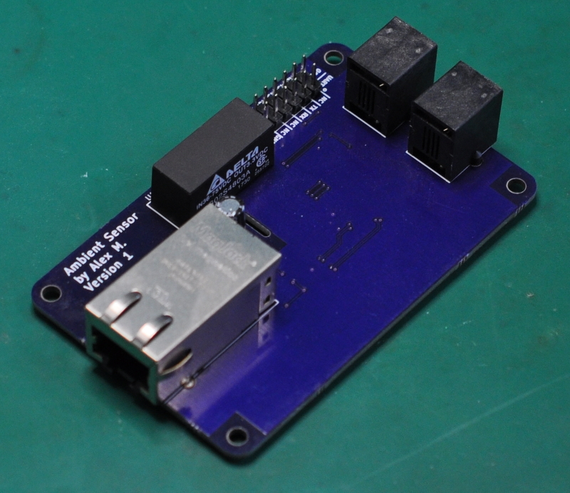

## Overview
Ultimately, the input is the sensors, and the output is a value in Home Assistant
```
Sensors → STM32 Microcontroller → W5500 (TCP/IP + Ethernet PHY) → MQTT Server → Home Assistant
```

## Design Choices
### Sensors
There are two primary sensors for measuring the environment:
* [Bosch Sensortec BME280](https://www.bosch-sensortec.com/bst/products/all_products/bme280)
  * Temperature
  * Humidity
  * Pressure
* [Texas Instruments OPT3002](http://www.ti.com/product/OPT3002)
  * Luminosity

These sensors are connected to the main board with short RJ-11 cables that connect to the I2C bus on the microcontroller.
In the case of the BME280 the external connection was necessary to obtain accurate measurements, the main PCB is hotter than the ambient environment, and it would skew temperature readings.

For the OPT3002 the external connection is to allow for easy positioning of the sensor.

The BME280 was chosen over cheaper alternatives, such as the Aosong AM2032 (DHT22) because [this in depth review](http://www.kandrsmith.org/RJS/Misc/Hygrometers/calib_many.html#commentary) speaks highly of the BM280 as compared to similar devices.

### Microcontroller
The STM32F070CBTx was chosen because:
1. STM provides a very good hardware adapter layer (HAL) for their micro-controllers.
2. STM provides a FreeRTOS port for their micro-controllers.
3. I wanted to do something new, my past projects have been mostly AVR.

### Firmware
The firmware uses [FreeRTOS](https://www.freertos.org/) for scheduling, simply because it seemed like a fun learning experience, and it was!

The micro-controller has 4 main threads running:
1. A sampling thread for the BM280
2. A sampling thread for the OPT3002
3. DHCP client
4. MQTT client

The sampling threads take data from the sensors and place it in a queue for the MQTT task.
The MQTT client thread pops the samples from the queue and publishes them to the MQTT server.
The DHCP client thread handles the leasing of an IP from the DHCP server.

In the interest of learning new things I also made some poor choices intentionally; I implemented my own DHCP client code, and my own MQTT client code.  This was not the smart choice, since there are polished DHCP clients out there, such as the one in [LwIP](https://savannah.nongnu.org/projects/lwip/), but this was the _fun_ choice.

Instructions for using the firmware can be found [here](AmbientSensor_Code/readme.md).

## Prototyping
I wanted to get the PCB for this right on the first try, so I prototyped everything on a breadboard.

Naturally a lot of components were not available in 2.54mm friendly packages, I made some breadboard friendly boards for these components:
* [NCP1090](https://github.com/newAM/DevBoard_NCP1090)
* [OPT3002](https://github.com/newAM/Breakout_OPT3002)
* [W5500](https://github.com/newAM/DevBoard_W5500)
* [STM32F070CBTx](https://github.com/newAM/Breakout_STM32F070CBTx)
* [JTAG Adapter](https://github.com/newAM/Adapter_JTAG20PinTo6Pin)
* [PoE magjack 0813-1X1T-57-F](https://github.com/newAM/Breakout_0813-1X1T-57-F)

Debug tools used
* [ST-LINK/V2](https://www.st.com/en/development-tools/st-link-v2.html) - USB debugger/programmer
* [Saleae Logic 8](https://cad.saleae.com/products/saleae-logic-8?variant=6998355738685) - USB Logic analyzer
* [TP-Link TL-POE150S Injector](https://www.tp-link.com/us/business-networking/accessory/tl-poe150s/) - PoE Injector
* [FTDI Friend v1.0](https://www.adafruit.com/product/284) - USB to serial adapter

### Prototype Media
#### Breadboard Prototype


#### Prototype Thermal


## V1 Hardware
The PCB is bigger than it needs to be because I was using the sample footprint that I have used for previous projects.
* [LoadCellOccupancy](https://github.com/newAM/LoadCellOccupany)
* [FanController](https://github.com/newAM/FanController)

### V1 Hardware Sensors
The sensors are on their own PCB with an RJ-11 connector.

#### BME280 sensor


#### OPT3002 sensor


### V1 Hardware Media
#### Front


#### Back


#### Front Thermal


#### Back Thermal


### V1 Hardware Erratum
* UASRT1_TX is connected to PA11, UASRT1_TX should be connected to PA9

### V1 Hardware Improvements
* The OPT3002 should be replaced with the OPT3001 since it has a response characteristic similar to the human eye.
