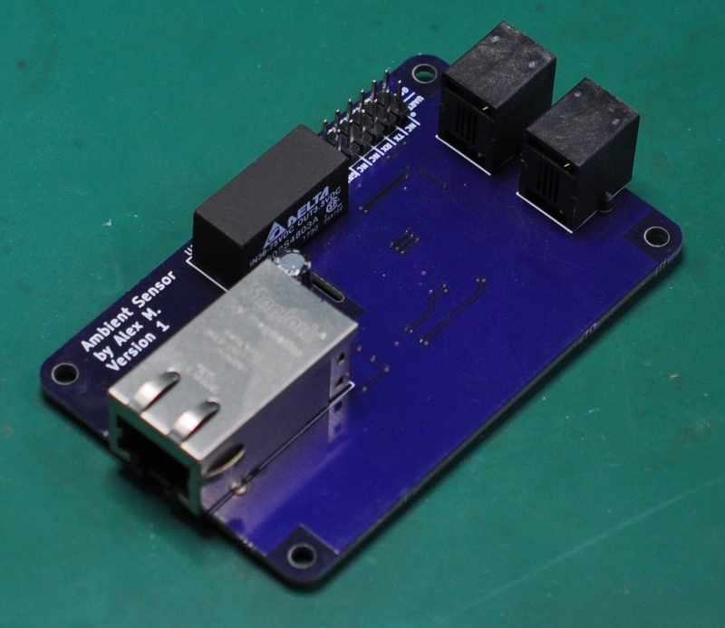
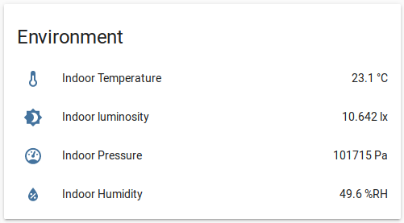

## Ambient Sensor

### What is it?
This project is a ambient environment sensor that gathers the luminosity, temperature, humidity, and pressure.  This data is transmitted in real time to my Home Assistant server via MQTT over Ethernet.

### Why?
I wanted to explore real-time adjustments of lighting, and window coverings to maintain constant light levels in a room, which requires high sample rates (multiple samples per second) for responsive adjustments.

When I started this project there were no high-sample rate luminosity sensors for home automation.  The devices that did exist either had low sample rates (minutes vs milliseconds), or were designed for scientific applications.

### Project Contents
* AmbientSensor_Code - firmware source code
* AmbientSensor_HomeAssisant - sample configuration for use with HomeAssistant
* AmbientSensor_KiCAD - schematic and PCB
* AmbientSensor_Peripheral - schematic and PCB for peripheral sensors
* AmbientSensor_Media - photos

### Prototype and Design
See [prototyping.md](prototyping.md) for the prototyping and design process.

### Software Used
* KiCAD 5.0.2
* GNU Make 4.1
* GNU gdb (GNU Tools for Arm Embedded Processors 7-2018-q3-update) 8.1.0.20180315
* GNU gcc (GNU Tools for Arm Embedded Processors 7-2018-q3-update) 7.3.1 20180622
* STM32CubeMX 5.1.0
* OpenOCD 0.10.0
